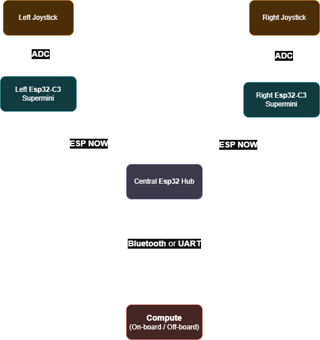

[](https://www.repostatus.org/#active)
[](https://en.wikipedia.org/wiki/C_(programming_language))

<h2>Summary</h2>

This project enables the high-precision wireless control of MISC, two robotic arms, using Feetech STS smart motors. By utilizing a distributed architecture of ESP32 microcontrollers, the system translates physical joystick inputs into real-time robotic movement, with XBOX controller protocol emulation.

It is designed for low latency and high reliability, featuring a central hub that aggregates data from multiple peripheral devices to synchronize motor behavior across a daisy-chained serial bus.

<h2>Features</h2>

<h3>Multi-Protocol Wireless Control</h3>

Leverages **ESP-NOW** to transmit joystick data from peripheral ESP32-C3 SuperMini units to a central hub with sub-second processing latency and **Bluetooth Low Energy (BLE)** to relay the combined data to a workstation.

<h3>XBOX Protocol Emulation</h3>

The central ESP32 Node-MCU formats incoming data to impersonate standard XBOX controller protocols using **jsTest**, allowing the robotic inputs to be recognized by standard simulation and gaming software.

<h3>Daisy-Chained Smart Servos</h3>

Controls a series of 4 **Feetech STS smart motors** via a single UART interface, maximizing hardware efficiency while maintaining individual motor addressability. Only visible [here](https://projectgrid.net/museum/mimicbrach)!

<h3>Precision Calibration</h3>

Includes a dedicated calibration suite using potentiometers to record non-zero offsets and an algorithmic safety layer to enforce the unique range of motion for each specific motor.

<h3>Functional Block Architecture</h3>

Components are grouped into logical clusters (Power, Processing, IO), significantly reducing the "Spaghetti Ratsnest" effect and shortening signal paths for improved electromagnetic compatibility (EMC).

<h3>Advanced Power Filtering</h3>

Features a precision decoupling strategy with 0.1uF and 22uF local energy reservoirs placed at the physical limit of the VCC pins to prevent high-frequency noise and random system crashes.

<h3>Thermal Heat Sinking</h3>

Utilizes strategic copper pours and ground planes to act as a passive heat sink for the L7805 regulator, preventing thermal shutdown in high-current applications.

<h3>Fabrication-Ready Constraints</h3>

Incorporates strict design rules for copper-to-edge clearances and mechanical "finger space," ensuring the board is both manufacturable and usable in real-world enclosures.

<h2>Technical Implementation</h2>

The architecture is split between input capture and central processing to minimize cumulative latency:

<h3>Peripheral Input (ESP32-C3 SuperMini)</h3>

Acts as the peripheral device for reading analog joystick inputs. It handles the initial signal processing and transmits the data packets wirelessly to the hub. It also supports a serial bridge for real-time robotic arm simulations.

<h3>Central Hub (ESP32 Node-MCU)</h3>

Aggregates data from both peripheral arms, handles the logic for motor ID deduction in daisy-chained configurations, and outputs the final formatted control signals.

<h3>Hardware & Power Management</h3>

* **Communication:** UART protocol for high-speed motor telemetry.
* **Power:** Powered by a programmable DC supply outputting **7.4V @ 2A**, optimized for the peak current draw of 4 smart motors.
* **Latency Control:** Rigorous experimental tuning using 3D-printed mini robot arms to ensure 100% mirroring of user inputs.

<h3>Functional Grouping & Routing</h3>

To avoid a "Spaghetti" ratsnest, MicroNode utilizes functional block grouping. All capacitors and resistors for the ESP32 are kept in close proximity to the MCU, while the L7805 and its filter capacitors form a dedicated power block. Components are rotated to minimize crossing "ratsnest" lines, resulting in shorter, straighter traces.

<h3>Local Energy Reservoirs</h3>

Electrical stability is maintained by placing the 0.1uF decoupling capacitor as close as physically possible to the VCC pin of the ESP32. This creates the shortest possible VCC-Capacitor-Ground loop, allowing the capacitor to filter high-frequency noise effectively.

<h3>Edge Clearance Constraints</h3>

To prevent the fabrication house's router bits from clipping copper traces, a "Copper to Edge" clearance of 0.5mm (20 mils) is enforced via KiCad’s Design Rules (Board Setup > Constraints). This protects the integrity of the yellow Edge.Cuts boundary during the milling process.

<h3>Thermal Management (L7805)</h3>

The L7805 linear regulator is given "breathing room" to convert excess voltage into heat safely. Instead of smothering it between larger components, it is connected to a large Ground Plane (Copper Pour) which pulls heat away from the regulator body.

<h3>Mechanical & 3D Verification</h3>

The KiCad 3D Viewer (Alt + 3) is used to verify "Finger Space." This ensures that connectors are not placed so close together that cables cannot be plugged in, and that tall components do not obstruct mechanical access.

<h2>Installation</h2>

Clone the project repository

```bash
git clone https://github.com/The-Mimic-Robotics/bimanual-wireless-joysticks.git
```

<h3>Peripheral (ESP32-C3 SuperMini)</h3>

Install the libraries

Upload Peripheral Code

1. Connect the ESP32-C3 SuperMini.
2. Change the BOARD_ID integer value!
3. Flash the device.

<h3>Central Hub (ESP32 Node-MCU)</h3>

Install the libraries

Upload Central Hub Code

1. Connect the ESP32 Node-MCU.
2. Flash the device.

<h3>Smart Motors Controller</h3>

Install the libraries

Upload [Code](https://projectgrid.net/museum/mimicbrach)

1. Connect the desired micro-controller
2. Flash the device.

<h2>Authors</h2>

|Maintainer|Gabrel Oliveira da Silva
|------------|-------------------------
|Status|Maintained/Active
|Web-Page|https://projectgrid.net
|Patch Work|https://github.com/The-Mimic-Robotics/bimanual-wireless-joysticks/commits?author=gabibdods
|SCM|https://github.com/The-Mimic-Robotics/bimanual-wireless-joysticks.git
|Files|ble_central/, ble_periph/, control_servo/, .tool-versions

|Maintainer|Ashal Patel
|------------|-------------------------
|Status|Maintained/Contributing
|Web-Page|https://portfolio-website-alpha-smoky-75.vercel.app
|Patch Work|https://github.com/The-Mimic-Robotics/bimanual-wireless-joysticks/commits?author=ac-pate
|SCM|https://github.com/The-Mimic-Robotics/bimanual-wireless-joysticks.git
|Files|imu_wt61/

<h2>Album</h2>

<h3>Network of micro-controllers</h3>



<h3>And more!</h3>

[Here!](https://projectgrid.net/mimicbrach)